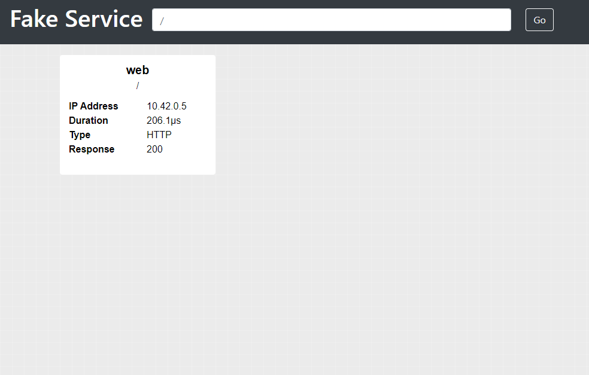

Blueprints are a collection of resources which can be created with the Shipyard tool. In their simplest form they are nothing more than one or
more text files in a folder.

In this tutorial you will learn how to create a Blueprint which will create a Kubernetes cluster, install an application to the cluster, and expose a Kubernetes service to your local machine.

## Structure and Dependencies

The resulting file structure you will create is going to look like this:

```shell
--- simple_kubernetes
  | --- network.hcl
  | --- k8s.hcl
  | --- k8s_app
  |     | --- app.yaml
  | --- README.md
```

When executing the `shipyard run` command Shipyard parses the current folder for `.hcl` files containing resources. It works out the dependencies of these resources and creates a graph which controls the order by which resources are created. For example, you are going to create the following resources in this example.

| resource type | file        |
| --------------| ----------- |
| network       | network.hcl |
| k8s_cluster   | k8s.hcl     |
| k8s_ingress   | k8s.hcl     |
| k8s_config    | k8s.hcl     |

There is an inherent dependency between these resources, for example, you can not create a Kubernetes cluster unless there is a network to attach it to, and you can not apply Kubernetes config to a cluster which does not exist.

Shipyard understands and manages these dependencies for you, for example, given your list of resources, the following graph would be produced by Shipyard.

```shell
--- simple_kubernetes
    | --- network
          | --- k8s_cluster
                | --- k8s_config
                | --- k8s_ingress
```

The first thing that Shipyard would do is to create a network, it validates that the network has been created successfully before proceeding to the next step.

Next, Shipyard creates the Kubernetes cluster and attaches it to the network, because there are dependencies which rely on the Kubernetes cluser, Shipyard automatically exectues health checks against the cluster to ensure it is ready for work.

Finally, Shipyard applies the Kubernetes config and creates the Kuberentes ingress, both of these steps happen in parallel as they share a common dependency on the cluster.

No matter what the type of resource you create, Shipyard manages the creation order for you.

Destroying resources with `shipyard destroy` reverses this process. Kubernetes ingresses and configuration are destroyed before clusters and networks. This is to ensure that the cleanup process is successful and no dangling resources are left hanging around.

**NOTE**: Before continuing, there is on important point. Shipyard **DOES NOT** recurse into sub folders. If you would like to use sub folders as part of your Blueprint you can use [modules](resources/module.md) to read resources not contained in the current folder.

## Creating your first resource

Create a folder called `simple_kubernetes`.

Inside that folder create a file called `network.hcl`, your folder strucutre should look like the following example.

```shell
--- simple_kubernetes
  | --- network.hcl
```

Inside the `network.hcl` file let's create a [network](/docs/resources/network.md) resource called `local` which uses a subnet of `10.10.0.0/16`.

```javascript
network "local" {
  subnet = "10.10.0.0/16"
}
```

Shipyard has the capability to incrementally create resources, it understands the difference between the resources defined in your Blueprint and those which have been created. Let's create the network before moving on.

Open a terminal in the `simple_kubernetes` folder and run the following command:

```shell
shipyard run
```

You should see the following output:

```shell
Running configuration from:  ./

2020-08-16T10:58:49.740+0100 [INFO]  Creating Network: ref=local
```

To see the status of currently running Shipyard resources you can use the `shipyard status` command.

```shell
➜ shipyard status

 [ CREATED ] network.local

Pending: 0 Created: 1 Failed: 0
```

Next lets see how you can create the Kubernetes cluster and expose resources in it

## Creating a Kubernetes cluster

The first thing you need to do is to create a [Kubernetes cluster](/docs/resources/k8s_cluster.md), create a new file called `k8s.hcl` in your `simple_kubernetes` folder.

Your file structure should now look like:

```shell
--- simple_kubernetes
  | --- network.hcl
  | --- k8s.hcl
```

Add the following code to the `k8s.hcl`:

```javascript
k8s_cluster "k3s" {
  driver  = "k3s" // default
  version = "v1.17.4-k3s1"

  nodes = 1 // default

  network {
    name = "network.local"
  }
}
```

Note the following `network` stanza which is a child of the k8s_cluster stanza, the value of the `name` parameter is set to the same resource name as the `network` you created earlier. It is this reference which allows Shipyard to calculate the dependency graph.

```javascript
network {
  name = "network.local"
}
```

## Deploying an application to Kubernetes

Let's now see how you can deploy an application to Kubernetes, first create a new folder inside `simple_kubernetes` called `k8s_app`, inside that create a file called `app.yaml`. Your structure should look like the following example:

```
--- simple_kubernetes
  | --- network.hcl
  | --- k8s.hcl
  | --- k8s_app
  |     | --- app.yaml
```

Inside `app.yaml` add the following Kubernetes resource:

```yaml
apiVersion: apps/v1
kind: Deployment
metadata:
  name: web-deployment
  labels:
    app: web
spec:
  replicas: 1
  selector:
    matchLabels:
      app: web
  template:
    metadata:
      labels:
        app: web
    spec:
      containers:
      - name: web
        image: nicholasjackson/fake-service:v0.14.1
        ports:
        - containerPort: 9090
        env:
        - name: "LISTEN_ADDR"
          value: "0.0.0.0:9090"
        - name: "NAME"
          value: "web"
        - name: "MESSAGE"
          value: "Hello World"
```

To deploy this application automatically you can use a [k8s_config](/docs/resources/k8s_config.md) resource. Add the following resource to your k8s.hcl file beneath the `k8s_cluster` resource.  The `cluster` parameter which references the `k8s_cluster` resource lets shipyard know of the dependency and create order between the two resources.

```javascript
k8s_config "app" {
  cluster = "k8s_cluster.k3s"

  paths = ["./k8s_app/"]
  wait_until_ready = true
}
```

Let's run Shipyard again and create the new resources, from a terminal in the `simple_kubernetes` folder run the following command.

```
shipyard run
```

You should see some output which looks like the following example:

```
Running configuration from:  ./

2020-08-16T11:21:26.580+0100 [INFO]  Creating Cluster: ref=k3s
2020-08-16T11:22:08.903+0100 [INFO]  Applying Kubernetes configuration: ref=app config=[/home/nicj/go/src/github.com/shipyard-run/shipyard-website/examples/simple_kubernetes/k8s_app]
```

Note that Shipyard only created the `k8s_cluster` and the `k8s_config` even though the resources contained in the blueprint also included the `network`. This is because Shipyard tracks the state of created resources. If you again run the `shipyard status` command you will see the following output.


```shell
➜ shipyard status

 [ CREATED ] network.local
 [ CREATED ] k8s_cluster.k3s
 [ CREATED ] k8s_config.app

Pending: 0 Created: 3 Failed: 0
```

When Shipyard created the cluster it outputs the Kubernetes config file used to access the cluster in the following location `$HOME/.shipyard/config/k3s/kubeconfig.yaml`.

You can use this file with `kubectl` to query the currently running pods.

```shell
KUBECONFIG=$HOME/.shipyard/config/k3s/kubeconfig.yaml kubectl get pods
```

You should see the following output.

```shell
NAME                              READY   STATUS    RESTARTS   AGE
web-deployment-5fb4db5465-b5tgd   1/1     Running   0          4m41s
```

Even if you did not have `kubectl` installed Shipyard would still have been apble to create the pod as it does not have any external dependencies other than the `Docker Engine`.

Let's look at a more userfriendly way of discovering and setting the environment variable for the Kubernetes configuration.

## Defining environment variables using Output resources

Shipyard has the concept of `output` resources, these variables which can contain information for the users of your blueprints or can be set as environment variables. Let's see how you can create an output variable. In the `k8s.hcl` file after the `k8s_config` resource add the following `output` variable stanza.

```javascript
output "KUBECONFIG" {
  value = "${k8s_config("k3s")}"
}
```

If you look at the `value` parameter of this resource you will see it contains a value `${k8s_config("k3s")}`, in Shipyard paramters the characters `${ }` are used to call a Shipyard function or to reference a variable. In this example you are calling the `k8s_config` function with a single parameter `k3s` which is the name of the `k8s_cluster` resource. At runtime Shipyard will interpret this function and replace it with the location of the Kubernetes config for the `k3s` cluster.

Let's see how this works, from the `simple_kubernetes` folder first create the new `output` resource using the `shipyard run` command:

```
➜ shipyard run   
Running configuration from:  ./

2020-08-16T11:40:11.739+0100 [INFO]  Creating Output: ref=KUBECONFIG
```

Output variables are just like resources, they need to be created with the `run` command before they can be used. You can then use the `shipyard output` command to show the defined output variables in the configuration.  This command will output a JSON formatted string containing all the `output` resources. 

```shell
➜ shipyard output
{
  "KUBECONFIG": "/home/nicj/.shipyard/config/k3s/kubeconfig-docker.yaml"
}
```

To view a single `output` you can also use the command `shipyard output <name>`, for example to see only the value of the `KUBECONFIG` `output` you can run the following command.

```shell
➜ shipyard output KUBECONFIG
/home/nicj/.shipyard/config/k3s/kubeconfig-docker.yaml
```

Using this approach you could use something like a bash subshell to set an environment variable:

```
export KUBECONFIG=$(shipyard output KUBECONFIG)
```

Shipyard has a command to save you this work called `shipyard env`, running this command Shipyard will automatically create an output string in your OS specific format for setting environment variables.

```shell
➜ shipyard env
export KUBECONFIG=/home/nicj/.shipyard/config/k3s/kubeconfig-docker.yaml
```

You could use this like the following example to set all the output variables in your Blueprint as environment variables:

```
eval $(shipyard env)
```

Let's now see how you can expose this running application to your local machine

## Exposing applications running in Kubernetes clusters

To expose the application you created inside the kubernetes cluster to your local computer you can use a `k8s_ingress` resource. The `k8s_ingress` resource will create a proxy which can be used to access an application running in a pod. Add the following resource definition to your `k8s.hcl` file. The order resources are placed in a file, or in fact which file the resources are placed in does not matter. Shipyard calculates dependency between resources by using parameters like `cluster`. It does not use file order. 

```javascript
k8s_ingress "app" {
  cluster = "k8s_cluster.k3s"

  network {
    name = "network.local"
  }

  deployment  = "web-deployment"

  port {
    local  = 9090
    remote = 9090
    host   = 9090
    open_in_browser = "/ui"
  }
}
```

Run Shipyard again to create this ingress:

```shell
➜ shipyard run
Running configuration from:  ./

2020-08-16T12:01:48.036+0100 [INFO]  Destroy Ingress: ref=app type=ingress
2020-08-16T12:01:48.296+0100 [INFO]  Creating Ingress: ref=app
```

Because of the `open_in_browser` parameter, Shipyard should open a URL in your browser which points at the newly created `k8s_ingress`.



That is all of the resources created for this simple application, before we finish, let's take a quick look at how you can provide documentation for your Blueprint.

## Documenting Blueprints

To help users consume your blueprints you can create usage documentation which is output to the terminal after the `shipyard run` command completes you can create a `README.md` file containing `Markdown` formatted documentation.

In the `simple_kubernetes` folder create a file called `README.md`. Your final folder structure should now look like the following example:

```
--- simple_kubernetes
  | --- network.hcl
  | --- k8s.hcl
  | --- k8s_app
  |     | --- app.yaml
  | --- README.md
```

Inside the `README.md` file add the following [Blueprint](/docs/resources/blueprint) definition.

```
---
title: Simple Kubernetes Example
author: Nic Jackson
slug: simplekube
---

This blueprint creates a simple Kubernetes cluster and install a simple application
```

When you execute the `shipyard run` command you will now see the following output:

```markdown
Running configuration from:  ./


########################################################

Title Simple Kubernetes Example
Author Nic Jackson

This blueprint creates a simple Kubernetes cluster and install a simple
application

This blueprint defines 1 output variables.

You can set output variables as environment variables for your current terminal session using the following command:

eval $(shipyard env)

To list output variables use the command:

shipyard output
```

That is it for this tutorial, just one final thing, how to destroy resources.

## Destroying resources

To remove and cleanup resources created with the `run` command you can use the `destroy` command. Run the following command in your terminal to clean up any resources created by this tutorial.

```shell
shipyard destroy
```

You will see that the order by which resources are destroy is the reverse of the creation order.

```shell
2020-08-16T12:59:26.902+0100 [INFO]  Destroy Ingress: ref=app type=ingress
2020-08-16T12:59:26.902+0100 [INFO]  Destroy Kubernetes configuration: ref=app config=[/home/nicj/go/src/github.com/shipyard-run/shipyard-website/examples/simple_kubernetes/k8s_app]
2020-08-16T12:59:27.195+0100 [INFO]  Destroy Cluster: ref=k3s
2020-08-16T12:59:27.623+0100 [INFO]  Destroy Network: ref=local
```

You have now learned all the core concepts of Shipyard and how you can create a simple configuration. The full source for this example can be found at [https://github.com/shipyard-run/shipyard-website/tree/main/examples/simple_kubernetes](https://github.com/shipyard-run/shipyard-website/tree/main/examples/simple_kubernetes). 